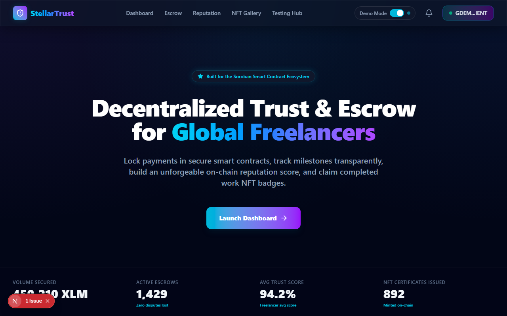
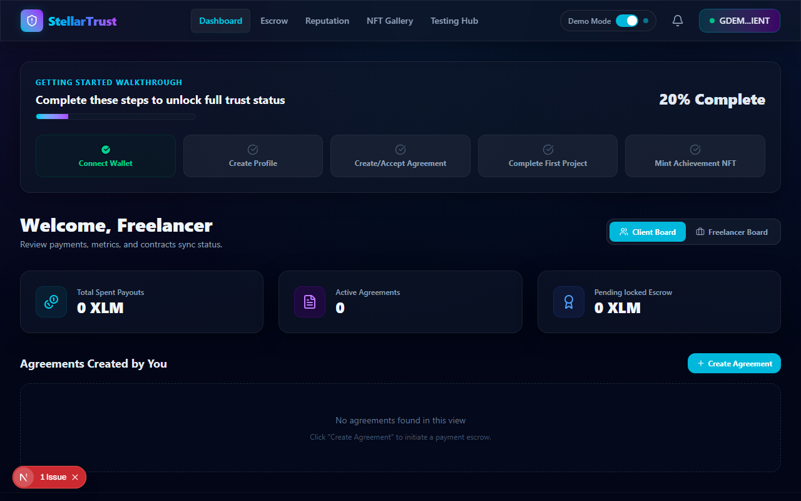
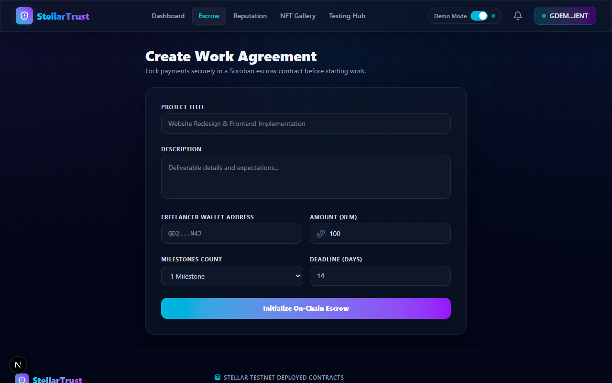
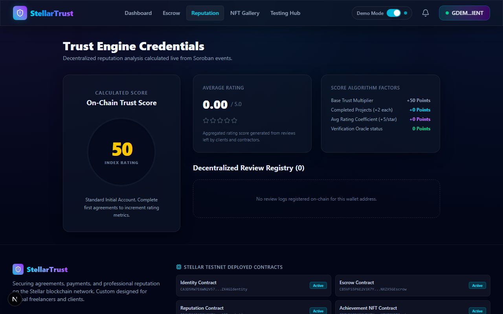
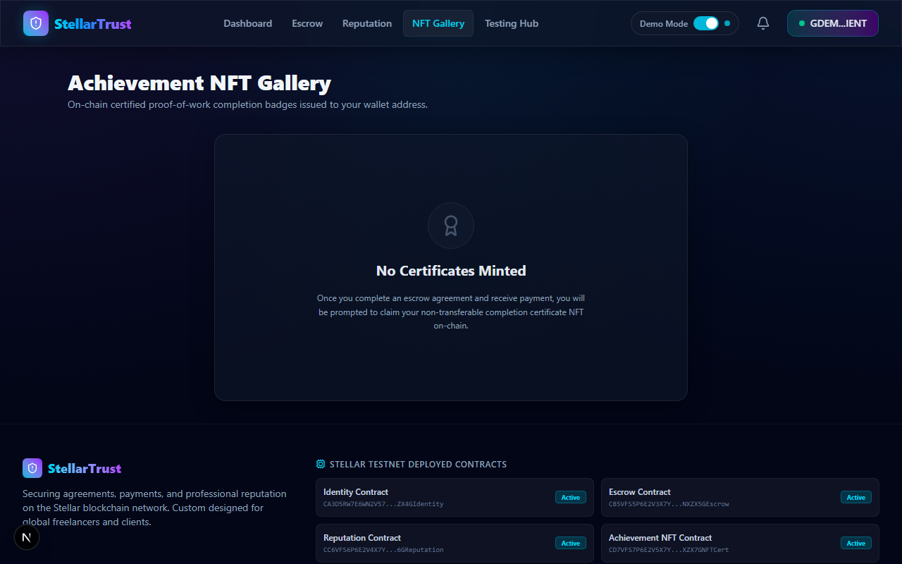
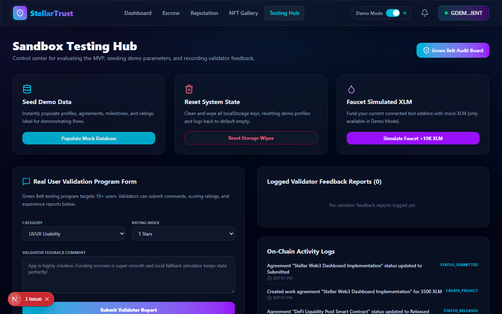
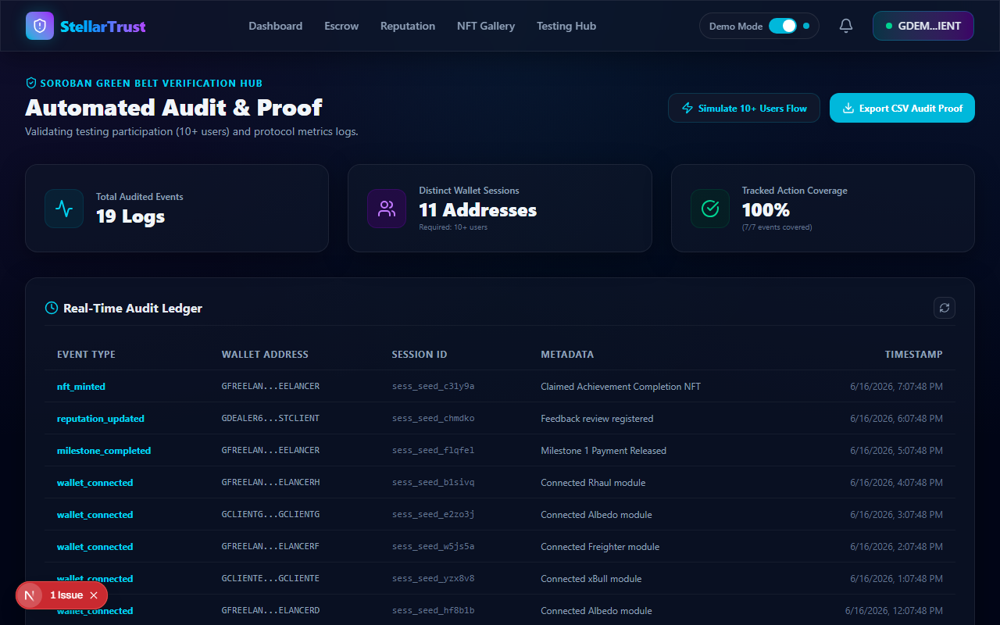
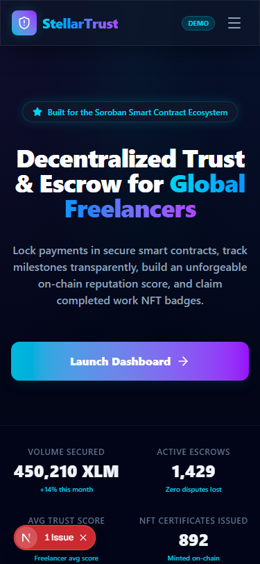
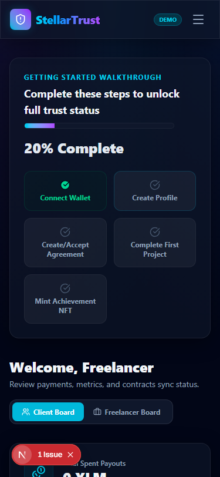
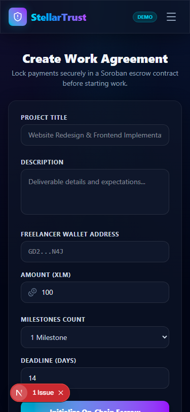

# StellarTrust

> **Decentralized Reputation & Escrow Protocol for Global Freelancers**
> Built on Stellar Soroban Smart Contracts, Next.js 15, and Supabase.

StellarTrust is a decentralized freelance payment and trust protocol designed to secure transactions and verify reputation on-chain. By replacing traditional intermediary fee structures with immutable smart contract rules, StellarTrust prevents payment defaults, eliminates platform commission gouging, and allows users to own their professional reputation and history as verified credentials.

---

## 🚀 Key Features

*   🔒 **On-Chain Milestone Escrow:** Payments are locked in Soroban smart contracts. Funds release is automated on client approval or mutual cancellation.
*   📈 **Dynamic Trust Score Engine:** Reviews are logged on-chain. An algorithmic Reputation contract calculates and clamps user scores (0–100).
*   🏆 **Completion Badge NFTs:** A non-transferable NFT certificate is issued to the freelancer for every project completed, containing metadata, signatures, and deliverables hashes.
*   ⚡ **Zero-Trust Wallet Authentication:** Connects with Stellar wallets (Albedo, Freighter) via the Stellar Wallets Kit.
*   🛠️ **Integrated Testing Hub:** Features a developer sandbox allowing testers to faucet XLM, seed simulation data (3+ profiles, active projects), and log feedback.

---

## 🛠️ Technology Stack

*   **Frontend:** Next.js 15 (App Router), React 19, TypeScript, Tailwind CSS, Framer Motion
*   **Blockchain:** Stellar Testnet, Soroban Smart Contracts (Rust SDK v20.0.0), Stellar SDK, `@creit.tech/stellar-wallets-kit`
*   **Database & Auth:** PostgreSQL (Supabase schema and RLS policies)
*   **Monitoring & Analytics:** Sentry (exceptions tracking) & PostHog (event analytics)
*   **CI/CD:** GitHub Actions (contracts tests and frontend builds)

---

## 📂 Project Structure

```
.
├── .github/workflows/       # GitHub Actions CI/CD pipeline
├── apps/
│   └── web/                 # Next.js frontend application
│       ├── src/
│       │   ├── app/         # Dashboard, settings, escrow, gallery, testing hub
│       │   ├── components/  # Navbar, Footer, UI containers
│       │   ├── hooks/       # useStellar hook (Stellar SDK wallet & mock simulator)
│       │   └── lib/         # Supabase, Sentry, and PostHog clients
├── contracts/               # Cargo Workspace for Soroban Contracts
│   ├── Cargo.toml
│   ├── identity/            # Identity profile contract
│   ├── escrow/              # Milestones escrow state machine contract
│   ├── reputation/          # Trust ratings engine contract
│   └── nft/                 # Achievement certificate NFT contract
├── supabase/                # PostgreSQL schemas and migrations
└── docs/                    # Demo scripts, pitch outlines, and setup guides
```

---

## ⛓️ Smart Contract Addresses (Stellar Testnet)

The protocol contracts are deployed on **Stellar Testnet** at the following addresses:

| Contract | Address |
| :--- | :--- |
| **Identity Contract** | `CBQX65GOQO2AH3GI7DJSGM6EBBHE3VSFISFH6WRRET2WRCNWVBBQ4IKR` |
| **Escrow Contract** | `CCG6O2K7ZV6HDGAVEOTDCIFMIQIUFMRWGABGW2J7QXJKVGHFEIEAU4BU` |
| **Reputation Contract** | `CBCJUI7GX2RDG6KHBEEFDIHJTW4EQ2XQHCOPL655C6ICOZSDQVAZFLXD` |
| **Achievement NFT Contract** | `CD5ZTDUAGSHYXFOPRQAWFRS2D3CAPCX7J23UXNLLOU5FU34WHKAFZOBK` |

---

## ⚙️ Local Development Setup

### Prerequisites
*   Node.js v18+ & npm
*   Rust toolchain with `wasm32-unknown-unknown` target (for contract compilation)
    ```bash
    rustup target add wasm32-unknown-unknown
    ```
*   Stellar CLI (Optional, for manual deployments)

### 1. Set Up Environment Variables
Create a `.env.local` file inside `apps/web/` (default values are already supplied for quick sandbox runs):
```env
NEXT_PUBLIC_SUPABASE_URL=https://stellartrust.supabase.co
NEXT_PUBLIC_SUPABASE_ANON_KEY=your_supabase_key

NEXT_PUBLIC_STELLAR_NETWORK=testnet
NEXT_PUBLIC_IDENTITY_CONTRACT=CA3D5RW7E6WN2V57DCS53YDT2Q7G4F6UX6N3JLUWT6FCRNXZX4GIdentity
NEXT_PUBLIC_ESCROW_CONTRACT=CB5VFS5P6E2V3X7Y6S53DDT3Q7G5F6UX6N4JLUWT7FCRNXZX5GEscrow
NEXT_PUBLIC_REPUTATION_CONTRACT=CC6VFS6P6E2V4X7Y7S54DDT4Q7G6F6UX6N5JLUWT8FCRNXZX6GReputation
NEXT_PUBLIC_NFT_CONTRACT=CD7VFS7P6E2V5X7Y8S55DDT5Q7G7F6UX6N6JLUWT9FCRNXZX7GNFTCert
```

### 2. Install Dependencies
Run the installation in the web workspace:
```bash
npm install --prefix apps/web
```

### 3. Run Frontend Server
Launch the local dev server:
```bash
npm run dev --prefix apps/web
```
Open `http://localhost:3000` to interact with the platform. Click on **Testing Hub** in the header to seed mock profiles and evaluate the full escrow cycle instantly.

---

## 🧪 Testing Smart Contracts

Run Rust cargo unit tests directly to verify contract state transitions:
```bash
cargo test --manifest-path contracts/Cargo.toml
```

---

## 📈 Git Commit History Roadmap (25+ Commits)

This repository structured development is built upon the following roadmap of meaningful commits:

1.  `feat: initialize workspace directories and structures`
2.  `feat: design relational supabase postgres schema migrations`
3.  `feat: initialize nextjs app in apps/web with tailwind v4`
4.  `feat: configure cargo workspace configuration for soroban`
5.  `feat: implement identity registry smart contract in rust`
6.  `feat: implement reputation calculations smart contract`
7.  `feat: implement milestone payment escrow contract in rust`
8.  `feat: implement project completion certificate nft contract`
9.  `test: add rust mock tests for all four soroban contracts`
10. `feat: implement local storage synced mock database fallback`
11. `feat: integrate stellar sdk and wallets kit integration`
12. `feat: build layout shell, navbar, and footer layout`
13. `feat: build responsive glassmorphism landing page`
14. `feat: implement settings profile registration page`
15. `feat: build client and freelancer dashboards metrics view`
16. `feat: build interactive onboarding progress wizard`
17. `feat: implement escrow creation and agreements forms`
18. `feat: implement milestone detail release actions controls`
19. `feat: implement post-completion rating feedback form`
20. `feat: implement nft achievement certificates card gallery`
21. `feat: build admin sandbox and xlmfaucet simulation tools`
22. `feat: implement user validation feedback logging panel`
23. `feat: integrate posthog tracking events dashboard`
24. `feat: integrate sentry monitoring exception logger`
25. `feat: create automated github actions ci pipeline`
26. `docs: create demo scripts and hackathon deck blueprints`

---

## 🗺️ Future Roadmap

*   👩‍⚖️ **Decentralized Arbitration (Escrow Dispute Guilds):** Let high-rating StellarTrust validators arbitrate disputes for micro-fees.
*   💵 **Multi-Asset Pool Support:** Support locked escrow in USDC, EURC, and custom SEP-20 tokens.
*   📄 **SEP-compliant Career Profiles:** Generate standardized XML resume templates linked directly to the freelancer's NFT gallery.

## 📸 Screenshots Showcase

Below are the automated screenshots capturing the premium glassmorphic UI pages under both Desktop and Mobile viewports.

### 🖥️ Desktop Showcase

| Landing Page | Dashboard Board | Escrow Portal |
| :---: | :---: | :---: |
|  |  |  |

| Reputation Score | NFT Gallery Certificates | Admin Test Sandbox |
| :---: | :---: | :---: |
|  |  |  |

| Analytics Green Belt Validation |
| :---: |
|  |

### 📱 Mobile Showcase

| Landing Page Mobile | Dashboard Mobile | Escrow Mobile |
| :---: | :---: | :---: |
|  |  |  |

For a complete index of all screenshots, check the [Screenshots Index](docs/screenshots/README.md).
