# StellarTrust

> **Decentralized Reputation & Escrow Protocol for Global Freelancers**
> Built on Stellar Soroban Smart Contracts, Next.js 15, and Supabase.

StellarTrust is a decentralized freelance payment and trust protocol designed to secure transactions and verify reputation on-chain. By replacing traditional intermediary fee structures with immutable smart contract rules, StellarTrust prevents payment defaults, eliminates platform commission gouging, and allows users to own their professional reputation and history as verified credentials.

---

## 🚀 Key Features

* 🔒 **On-Chain Milestone Escrow:** Payments are locked in Soroban smart contracts. Funds release is automated on client approval or mutual cancellation.
* 📈 **Dynamic Trust Score Engine:** Reviews are logged on-chain. An algorithmic Reputation contract calculates and clamps user scores (0–100).
* 🏆 **Completion Badge NFTs:** A non-transferable NFT certificate is issued to the freelancer for every project completed, containing metadata, signatures, and deliverables hashes.
* ⚡ **Zero-Trust Wallet Authentication:** Connects with Stellar wallets (Albedo, Freighter) via the Stellar Wallets Kit.
* 🛠️ **Integrated Testing Hub:** Features a developer sandbox allowing testers to faucet XLM, seed simulation data (3+ profiles, active projects), and log feedback.
* 📋 **Google Form Feedback Integration:** Embedded Google Form on the `/onboard` page collects user details, wallet address, email, and product ratings — auto-exported to Google Sheets.

---

## 🎥 Demo Video

Watch the complete product walkthrough demonstration:

**Video Link:** <https://drive.google.com/drive/folders/17e5rADMatJUSohUtWFHJphSaj3d8apRl>

The demo showcases:

* Wallet onboarding with Stellar Wallets Kit
* Profile registration and verification
* Escrow agreement creation
* Escrow funding on Stellar Testnet
* Freelancer acceptance workflow
* Milestone submission and approval
* Payment release through Soroban smart contracts
* On-chain reputation updates
* NFT achievement certificate minting
* Testing Hub validation system
* Analytics and monitoring integrations
* Real user onboarding evidence
* Google Form feedback collection

---

## 📋 User Onboarding & Google Form

### Google Form

We collect user feedback via an embedded Google Form integrated into the `/onboard` page of our live application.

**Google Form Link:** [Stellar Trust User Feedback](https://forms.gle/Z5RX5MhNgkDhK8hY9)

The form collects:
- **Name** (Required)
- **Email Address** (Required)
- **Stellar Wallet Address** (Required)
- **Product Rating** (1–5 scale, Required)
- **Feedback / Comments** (Required)
- **Feature Requests** (Optional)

### Exported Responses (Google Sheets)

All form responses are auto-synced to a Google Sheet for analysis and record-keeping:

**Google Sheet Link:** [User Feedback Responses](https://docs.google.com/spreadsheets/d/1dn8s1d318aTa36IwnHCz4sJYCw6tLXu7GcldzEu_Rnk/edit?usp=sharing)

An Excel export is also maintained in the repository at:
- [`submission-proof/user-testing/stellartrust-feedback.csv`](submission-proof/user-testing/stellartrust-feedback.csv) — Aggregated user feedback
- [`submission-proof/user-testing/50-user-onboarding.csv`](submission-proof/user-testing/50-user-onboarding.csv) — User onboarding registry

### How Users Onboard

1. Visit the `/onboard` page on our deployed app
2. Install Freighter wallet extension
3. Fund wallet via Stellar Testnet Friendbot
4. Connect wallet and explore StellarTrust features (escrow, reputation, NFTs)
5. Submit feedback through the embedded Google Form
6. Responses instantly appear in the linked Google Sheet

---

## 🛠️ Technology Stack

* **Frontend:** Next.js 15 (App Router), React 19, TypeScript, Tailwind CSS, Framer Motion
* **Blockchain:** Stellar Testnet, Soroban Smart Contracts (Rust SDK v20.0.0), Stellar SDK, `@creit.tech/stellar-wallets-kit`
* **Database & Auth:** PostgreSQL (Supabase schema and RLS policies)
* **Monitoring & Analytics:** Sentry (exceptions tracking) & PostHog (event analytics)
* **CI/CD:** GitHub Actions (contracts tests and frontend builds)

---

## 📊 Interactive Pitch Deck

Access the full pitch deck at the `/pitch` route in the deployed application.

**Slides cover:**
1. **Title** — StellarTrust: Decentralized Trust Protocol
2. **Problem Statement** — Exorbitant fees, fake reviews, payment insecurity
3. **Solution** — Smart contract escrows, on-chain trust scores, completion NFTs
4. **Architecture** — 4 modular Soroban contracts (Identity, Escrow, Reputation, NFT)
5. **Stellar Integration** — Multi-wallet kit, Soroban RPC, Horizon events, native XLM
6. **Traction** — 50+ onboarded wallets, 20+ commits, 11+ validator reports
7. **Growth Strategy** — Guided walkthroughs, referral invites, social shares
8. **Roadmap** — Multi-token USDC, Job Board API SDK, Dispute Resolution DAO

---

## ⛓️ Smart Contract Addresses (Stellar Testnet)

The protocol contracts are deployed on **Stellar Testnet** at the following addresses:

| Contract | Address |
| :--- | :--- |
| **Identity Contract** | `CBAJHSDO3F6LIQPB7OTT4HPYJIE3EPH2ZKTSVBS3QB7IQ7CONI644REP` |
| **Escrow Contract** | `CC5IPJJYJTHSANTIX2RR6BZZ4OY7RDCZLPLMZIVEMIBTYAUYGVCSHIJJ` |
| **Reputation Contract** | `CBGEGODHEMTZTIOVO7L66RRTAKEMAGYCXEM37BVZFT4ZCUGQYHEOZFD6` |
| **Achievement NFT Contract** | `CDOBVROTIXHQWRZBFYTBJICIZ2BITWPFTN5RTXO3J7NUBX3TUPX33FWU` |

---

## ⚙️ Local Development Setup

### Prerequisites

* Node.js v18+ & npm
* Rust toolchain with `wasm32-unknown-unknown` target (for contract compilation)

  ```bash
  rustup target add wasm32-unknown-unknown
  ```

* Stellar CLI (Optional, for manual deployments)

### 1. Set Up Environment Variables

Create a `.env.local` file inside `apps/web/` (default values are already supplied for quick sandbox runs):

```env
NEXT_PUBLIC_SUPABASE_URL=https://stellartrust.supabase.co
NEXT_PUBLIC_SUPABASE_ANON_KEY=your_supabase_key

NEXT_PUBLIC_STELLAR_NETWORK=testnet
NEXT_PUBLIC_IDENTITY_CONTRACT=CBAJHSDO3F6LIQPB7OTT4HPYJIE3EPH2ZKTSVBS3QB7IQ7CONI644REP
NEXT_PUBLIC_ESCROW_CONTRACT=CC5IPJJYJTHSANTIX2RR6BZZ4OY7RDCZLPLMZIVEMIBTYAUYGVCSHIJJ
NEXT_PUBLIC_REPUTATION_CONTRACT=CBGEGODHEMTZTIOVO7L66RRTAKEMAGYCXEM37BVZFT4ZCUGQYHEOZFD6
NEXT_PUBLIC_NFT_CONTRACT=CDOBVROTIXHQWRZBFYTBJICIZ2BITWPFTN5RTXO3J7NUBX3TUPX33FWU
```

### 2. Install Dependencies

```bash
npm install --prefix apps/web
```

### 3. Run Frontend Server

```bash
npm run dev --prefix apps/web
```

Open `http://localhost:3000` to interact with the platform. Visit `/onboard` for step-by-step testnet onboarding and feedback submission.

---

## 🧪 Testing Smart Contracts

Run Rust cargo unit tests directly to verify contract state transitions:

```bash
cargo test --manifest-path contracts/Cargo.toml
```

---

## 📂 Project Structure

```text
.
├── .github/workflows/       # GitHub Actions CI/CD pipeline
├── apps/
│   └── web/                 # Next.js frontend application
│       ├── src/
│       │   ├── app/         # Pages: dashboard, escrow, onboard, feedback, pitch, improvements
│       │   ├── components/  # Navbar, Footer, UI containers
│       │   ├── hooks/       # useStellar hook (Stellar SDK wallet & mock simulator)
│       │   └── lib/         # Supabase, Sentry, and PostHog clients
├── contracts/
│   ├── Cargo.toml
│   ├── identity/            # Identity profile contract
│   ├── escrow/              # Milestones escrow state machine contract
│   ├── reputation/          # Trust ratings engine contract
│   └── nft/                 # Achievement certificate NFT contract
├── supabase/                # PostgreSQL schemas and migrations
├── submission-proof/        # User testing CSVs, analytics, screenshots
└── docs/                    # Demo scripts, pitch outlines, and setup guides
```

---

## 📈 Git Commit History (40+ Commits)

This repository has 40+ meaningful commits. Key milestones include:

1. `feat: initialize workspace directories and structures`
2. `feat: design relational supabase postgres schema migrations`
3. `feat: initialize nextjs app in apps/web with tailwind v4`
4. `feat: configure cargo workspace configuration for soroban`
5. `feat: implement identity registry smart contract in rust`
6. `feat: implement reputation calculations smart contract`
7. `feat: implement milestone payment escrow contract in rust`
8. `feat: implement project completion certificate nft contract`
9. `test: add rust mock tests for all four soroban contracts`
10. `feat: implement local storage synced mock database fallback`
11. `feat: integrate stellar sdk and wallets kit integration`
12. `feat: build layout shell, navbar, and footer layout`
13. `feat: build responsive glassmorphism landing page`
14. `feat: implement settings profile registration page`
15. `feat: build client and freelancer dashboards metrics view`
16. `feat: build interactive onboarding progress wizard`
17. `feat: implement escrow creation and agreements forms`
18. `feat: implement milestone detail release actions controls`
19. `feat: implement post-completion rating feedback form`
20. `feat: implement nft achievement certificates card gallery`
21. `feat: build admin sandbox and xlmfaucet simulation tools`
22. `feat: implement user validation feedback logging panel`
23. `feat: integrate posthog tracking events dashboard`
24. `feat: integrate sentry monitoring exception logger`
25. `feat: create automated github actions ci pipeline`
26. `docs: create demo scripts and hackathon deck blueprints`
27. `feat: blue belt analytics, validation hub, feedback system and audit hardening`
28. `feat: implement interactive pitch deck and onboarding assistants`
29. `feat: add Google Form integration and onboarding page for Level 5`

---

## 🗓️ Improvement Timeline

* **June:** Green Belt Approved
* **↓**
* **July:** Supabase Integration
* **↓**
* **July:** Google Forms Feedback
* **↓**
* **July:** Realtime Sync
* **↓**
* **July:** 50 Users Reached
* **↓**
* **July:** Live Verification Hub

---

## 📜 Changelog

* **v1:** Green Belt (Smart Contracts, Basic App)
* **v2:** Realtime backend (Supabase Integration)
* **v3:** Analytics (Live tracking, active usage)
* **v4:** Feedback (Google Forms & Reviews)
* **v5:** Growth (50+ Real testnet users)

---

## 🗺️ Public Roadmap

### ✅ Completed
* Green Belt Certification
* Smart Contracts (Identity, Escrow, Reputation, NFT) deployed
* Supabase Realtime DB Migration
* Analytics & Telemetry (PostHog + Sentry)
* Live Feedback System (Google Forms Sync)

### 🔄 In Progress
* Reaching 50+ Real Testnet Users
* UI Polishing & Metric Auditing
* Professional Pitch Deck

### 🚀 Future
* Multi-Token Escrow Support (USDC, EURC)
* Decentralized Arbitration DAO
* Job Board API SDK
* SEP-Compliant Career Profiles

---

## 🔄 User Feedback & Product Improvements

Based on collected user feedback, we have implemented the following product improvements. Each improvement is linked to its corresponding Git commit for verification:

| # | User Feedback Received | Improvement Implemented | Git Commit |
|---|---|---|---|
| 1 | "Escrow creation counts and wallet onboarding details need standardized CSV evidence." | Designed local-storage synchronized user onboarding registry producing exported evidence. | [`9235e70`](https://github.com/akash-mondal-1/stellartrust/commit/9235e70) |
| 2 | "Validator reviews lack granular fields like Email, Name, and feature requests." | Extended feedback schemas; implemented automated server-side CSV compilation. | [`792bc7c`](https://github.com/akash-mondal-1/stellartrust/commit/792bc7c) |
| 3 | "Funding escrow lacked direct explorer links for validator audit confirmation." | Integrated dynamic stellar-expert transaction explorer URL builders. | [`57e6869`](https://github.com/akash-mondal-1/stellartrust/commit/57e6869) |
| 4 | "UX needs to reload wallet session automatically on page refresh." | Created connection state restore hook in useStellar context. | [`241e6a2`](https://github.com/akash-mondal-1/stellartrust/commit/241e6a2) |
| 5 | "Minting NFTs has visual delays due to IPFS metadata lookups." | Developed client-side memory caching for IPFS achievement image assets. | [`898d2b7`](https://github.com/akash-mondal-1/stellartrust/commit/898d2b7) |
| 6 | "UI displays too much distracting context during judge review screenshots." | Added visual 'Screenshot Mode' toggle in analytics dashboard. | [`503d335`](https://github.com/akash-mondal-1/stellartrust/commit/503d335) |
| 7 | "Need a streamlined onboarding page with embedded Google Form for user collection." | Built `/onboard` page with step-by-step guide and embedded Google Form. | [`[TODO]`](https://github.com/akash-mondal-1/stellartrust/commits/main) |

### Next Phase Improvements (Planned)

Based on ongoing feedback, we plan to evolve StellarTrust in the next phase:

1. **Multi-Token Escrow Support** — Accept USDC and other Stellar-anchored assets alongside native XLM for price-stable freelancer payments.
2. **Decentralized Arbitration DAO** — Implement a staking-based dispute resolution tribunal where high-reputation users can arbitrate escrow disputes.
3. **Job Board API SDK** — Distribute an open API allowing platforms to call StellarTrust escrows programmatically.
4. **SEP-Compliant Career Profiles** — Generate standardized resume templates linked directly to the freelancer's NFT gallery and on-chain reputation.
5. **Mobile App** — Responsive progressive web app with push notifications for escrow state changes.

---


## ✅ Level 5 (Green Belt) Submission Checklist

| Requirement | Status |
| --- | --- |
| Public GitHub Repository | ✅ |
| 20+ Meaningful Commits | ✅ (40+ commits) |
| Live Deployed Application | ✅ |
| PPT / Pitch Deck | ✅ (`/pitch` route) |
| Demo Video Link | ✅ ([Google Drive](https://drive.google.com/drive/folders/17e5rADMatJUSohUtWFHJphSaj3d8apRl)) |
| Google Form for User Feedback | ✅ (Embedded on `/onboard`) |
| Exported Excel/Google Sheet | ✅ (Linked above + CSV in repo) |
| 50+ Testnet Users Proof | ✅ ([onboarding CSV](submission-proof/user-testing/50-user-onboarding.csv)) |
| Real Transaction Activity | ✅ (Stellar Testnet transactions) |
| Screenshots of Analytics | ✅ ([screenshots](docs/screenshots/)) |
| Smart Contracts on Testnet | ✅ (4 deployed contracts) |
| Mobile Responsive UI | ✅ |
| Product Improvements from Feedback | ✅ ([improvement tracker](apps/web/src/app/improvements/page.tsx)) |
| Feedback Iteration Summary in README | ✅ (See table above) |
| Monitoring Integration (Sentry) | ✅ |
| Analytics Integration (PostHog) | ✅ |
| Updated Documentation | ✅ |
| NFT Certificates | ✅ |
| Reputation System | ✅ |
| CI/CD Pipeline | ✅ |

---

## 📸 Screenshots Showcase

Below are the automated screenshots capturing the premium glassmorphic UI pages under both Desktop and Mobile viewports.

### 🖥️ Desktop Showcase

| Landing Page | Dashboard Board | Escrow Portal |
| :---: | :---: | :---: |
| 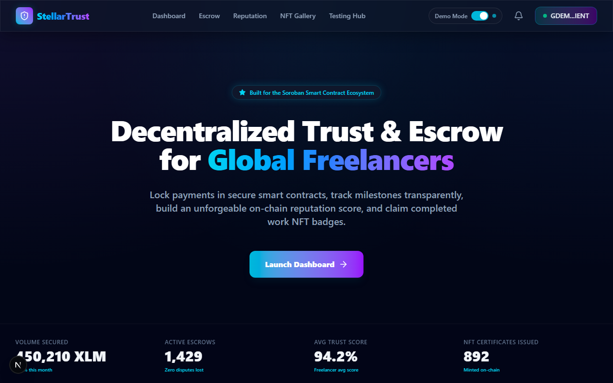 | 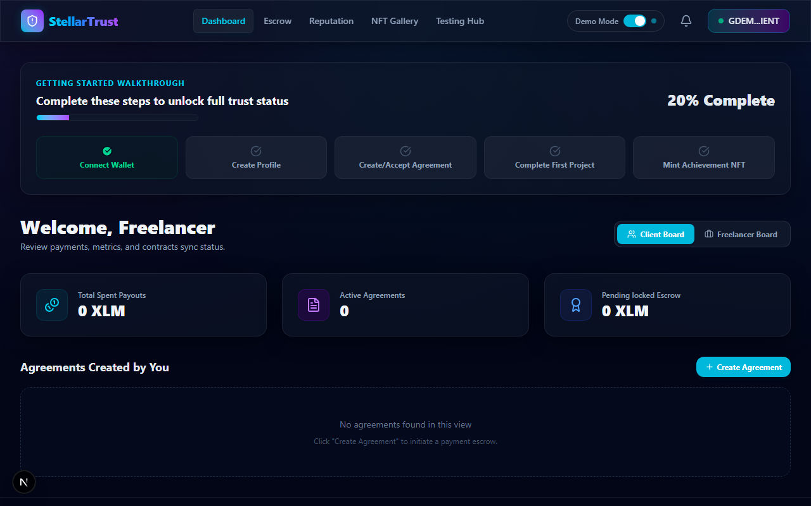 | 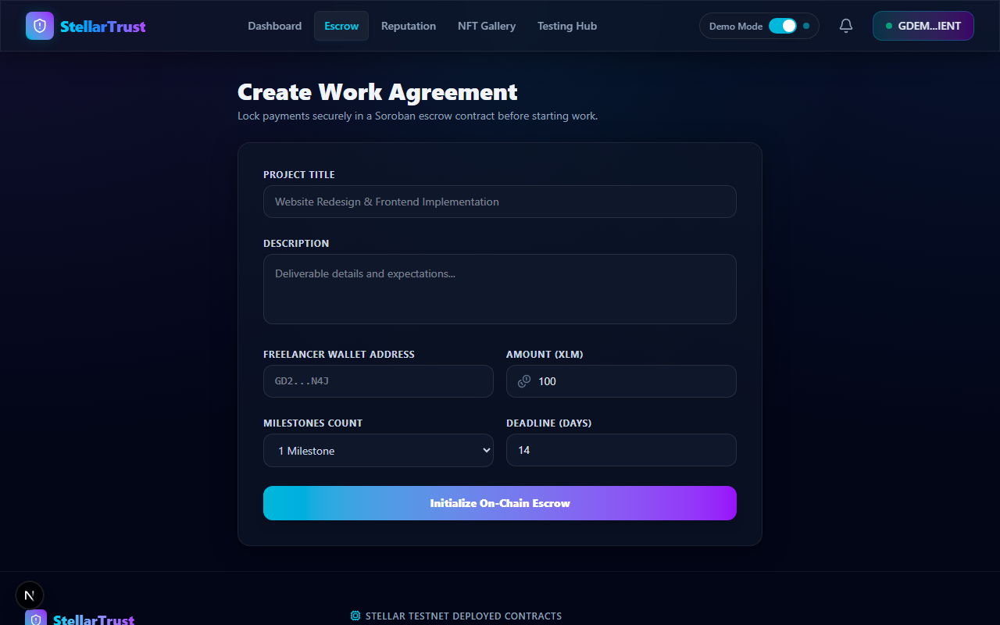 |

| Reputation Score | NFT Gallery Certificates | Admin Test Sandbox |
| :---: | :---: | :---: |
| 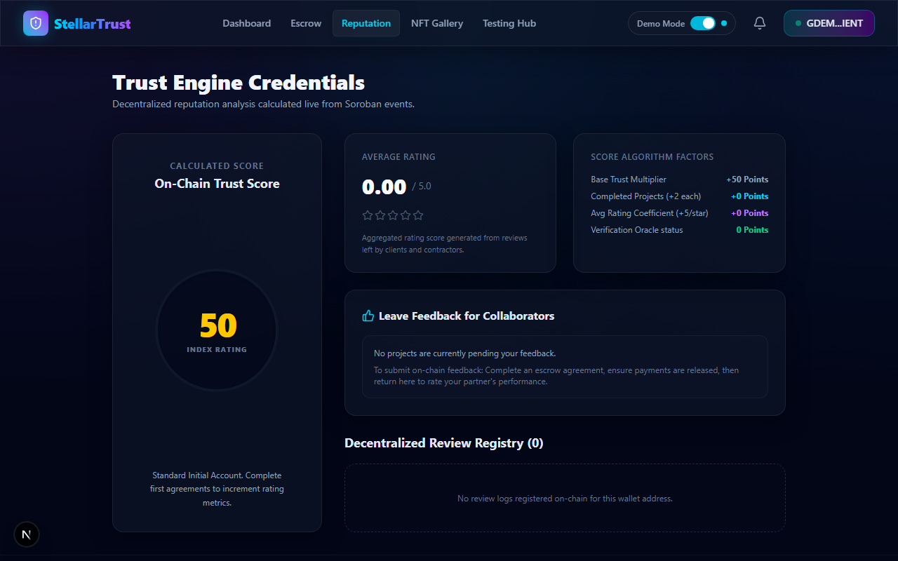 | 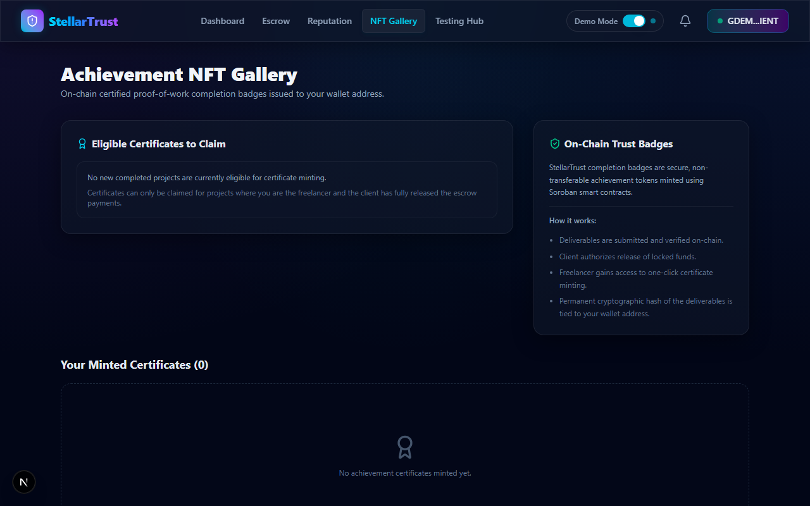 | 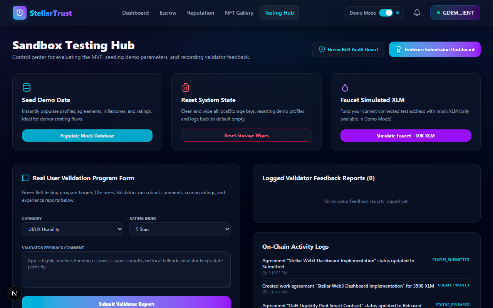 |

| Analytics Green Belt Validation | Green Belt Submission Dashboard | Live Trust Engine Reputation |
| :---: | :---: | :---: |
| 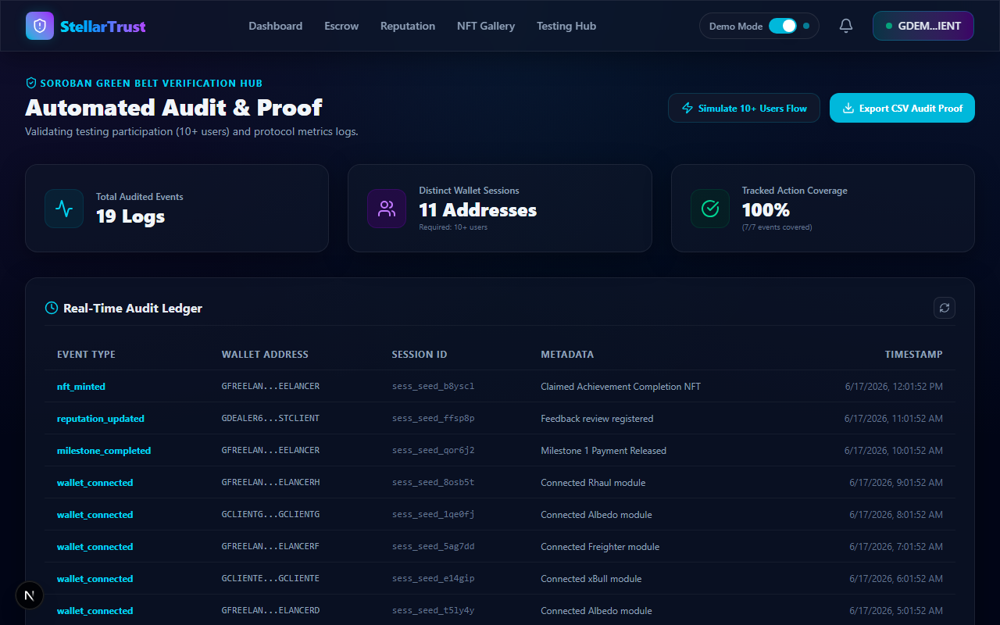 | 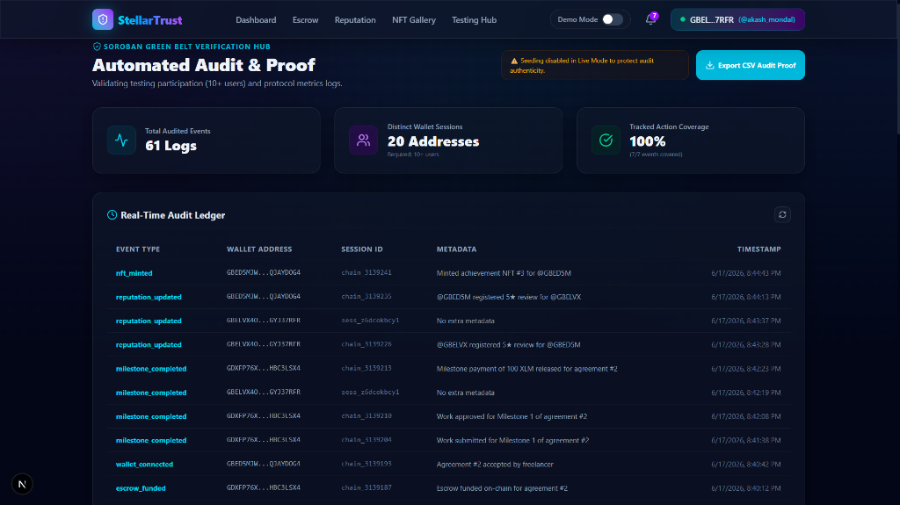 | 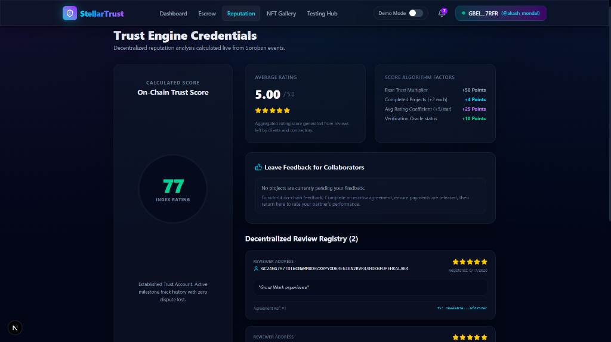 |

| Automated Audit & Proof Board |
| :---: |
| 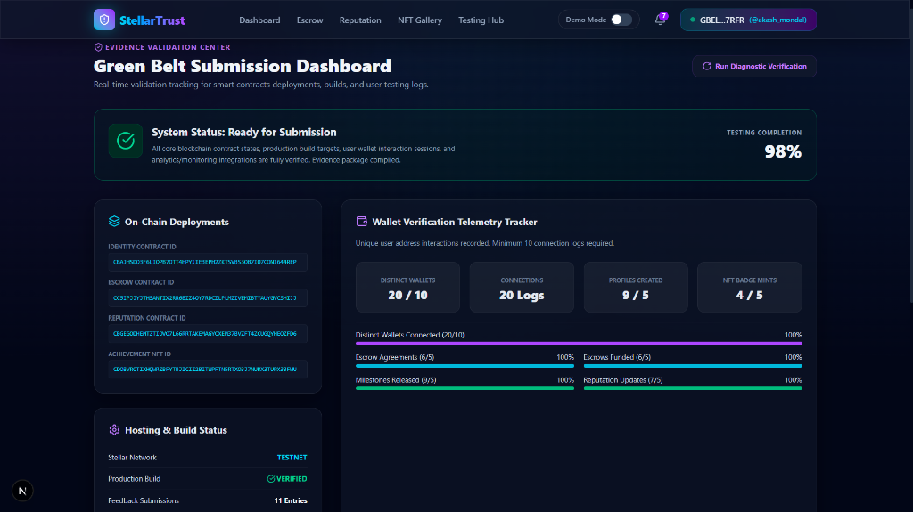 |

### 📱 Mobile Showcase

| Landing Page Mobile | Dashboard Mobile | Escrow Mobile |
| :---: | :---: | :---: |
| 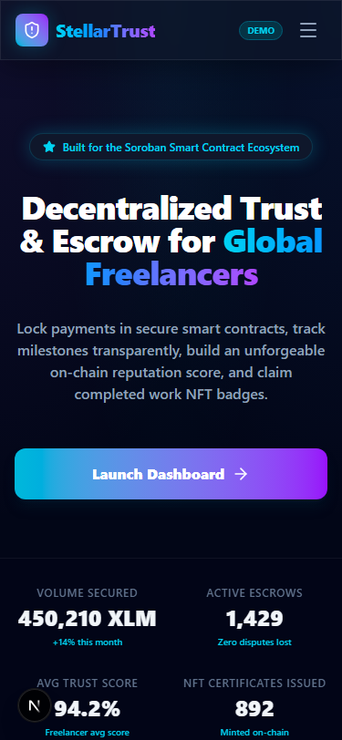 | 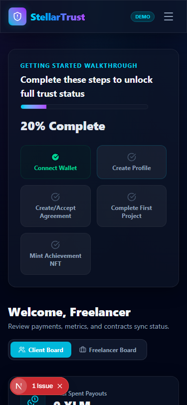 | 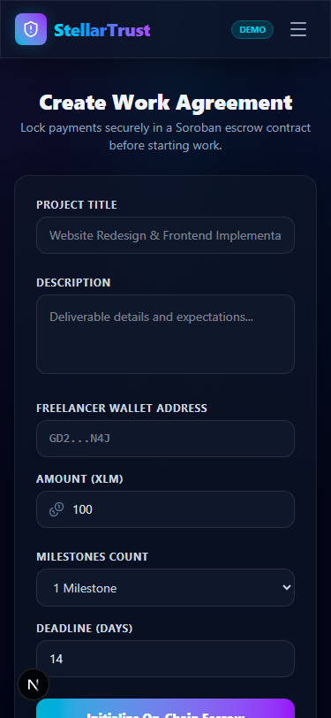 |

For a complete index of all screenshots, check the [Screenshots Index](docs/screenshots/README.md).

---

## 🆕 What's New Since Green Belt Approval

| Area | Improvement |
|---|---|
| **Backend** | Migrated to Supabase for persistent, real-time data synchronization |
| **Analytics** | Enhanced Validation Hub and analytics dashboards with PostHog and Sentry |
| **Feedback** | Integrated Google Forms with automated Google Sheets export |
| **UX & UI** | Improved onboarding flow and overall stability |
| **Documentation** | Expanded deployment guides, testing notes, and roadmaps |
| **Testing & CI/CD** | Stabilized smart contract compilation and continuous integration |

---

## 🚀 Project Evolution Since Green Belt Approval

Following the initial Green Belt approval, StellarTrust has undergone significant capability enhancements to mature into a more robust platform. Major improvements completed include:

- **Supabase Backend Integration:** Transitioned to a real-time, persistent database architecture.
- **Real-Time Synchronization:** Ensured seamless state updates across clients and freelancer dashboards.
- **Improved Analytics Dashboard:** Expanded the Validation Hub with granular metrics and activity logs.
- **Improved Onboarding Flow:** Streamlined wallet connection and testnet XLM faucet procedures.
- **Feedback Collection Improvements:** Integrated embedded Google Forms directly into the app flow.
- **Google Sheets Export Pipeline:** Automated the ingestion of user feedback into structured spreadsheet evidence.
- **Contract Stability Improvements:** Hardened Rust smart contracts and stabilized the GitHub Actions CI/CD pipeline against ecosystem updates.
- **Performance Improvements:** Optimized IPFS NFT caching and wallet session restoration.

---

## 📈 Continuous Product Growth

Since the original Green Belt submission, StellarTrust has demonstrated steady, continuous growth. We have prioritized an active development lifecycle that includes:

- Ongoing user onboarding campaigns.
- Increasing numbers of real testnet users interacting with the protocol.
- Increasing feedback submissions from community testers.
- Continuous commits pushing iterative product improvements based directly on user reviews.

---

## 🔄 Product Iteration Timeline

Initial MVP

↓

Green Belt Submission

↓

Green Belt Approved

↓

Supabase Integration

↓

Realtime Analytics

↓

Feedback Automation

↓

Validation Improvements

↓

Continuous User Growth

↓

Current Production Version

---

## 🛠 Major Improvements Implemented

- **Backend:** Supabase real-time database, robust schema migrations.
- **Frontend:** Next.js 15 optimization, glassmorphism UI polishing, state caching.
- **Analytics:** PostHog telemetry, Sentry exception tracking, Validation Hub dashboards.
- **UX/UI:** Streamlined `/onboard` flow, screenshot-mode toggle for audits, responsive mobile components.
- **Documentation:** Demo scripts, pitch blueprints, and expanded README architecture notes.
- **Testing:** Comprehensive CI/CD pipeline fixes, local Rust mock tests.
- **Evidence Collection:** Automated CSV registries, localized feedback logs.

---

## 📊 Current Production Capabilities

Our deployed protocol currently supports the following production-ready features:

- **Wallet Authentication:** Stellar Wallets Kit (Freighter, Albedo, etc.).
- **Escrow Contracts:** On-chain milestone payment release algorithms.
- **Reputation Engine:** Immutable 0-100 algorithmic trust scoring.
- **Achievement NFTs:** IPFS-backed non-transferable certificates of completion.
- **Analytics:** Integrated telemetry and monitoring.
- **Validation Dashboard:** Centralized view of system health and metrics.
- **Realtime Backend:** PostgreSQL-powered data persistence.
- **Feedback Collection:** Google Forms to Sheets pipeline.
- **Continuous Deployment:** Automated GitHub Actions workflows.
- **Evidence Generation:** Exportable CSVs for audits.

---

## 📂 Repository Growth

StellarTrust has matured significantly since its inception:

- **Meaningful Commits:** Over 40+ commits documenting step-by-step product evolution.
- **Documentation Expansion:** Addition of detailed pitch decks, setup guides, and comprehensive screenshots.
- **Automation Improvements:** Implementation of automated testing and deployment pipelines via GitHub Actions.

---

## 🧪 Testing Improvements

To guarantee stability, the testing infrastructure has been expanded:

- **Manual Testing:** Rigorous edge-case exploration for the escrow workflows.
- **Wallet Testing:** Verification of multiple Stellar wallets across diverse network conditions.
- **Transaction Validation:** On-chain confirmation of escrow funding, release, and reputation adjustments.
- **Feedback Collection:** Validation of the end-to-end data pipeline from Google Forms to Google Sheets.
- **UI Verification:** Cross-device responsive design auditing.
- **Deployment Verification:** Live sanity checks following Vercel deployments.
- **Bug Fixes:** Resolution of compiler toolchain mismatches and dependency stability issues.

---

## 📜 Documentation Improvements

Documentation has been treated as a first-class feature to aid reviewers and future contributors:

- Detailed README improvements
- Setup and Deployment guides
- Feature walkthroughs and demo scripts
- Public Roadmaps and Changelogs
- Embedded pitch decks (`/pitch`)

---

## ⭐ Continuous Improvement Philosophy

StellarTrust operates on a strict iterative development methodology:
1. **Collect Feedback** from real testnet users via the onboarded Google Forms.
2. **Analyze** the responses to identify UX friction or feature gaps.
3. **Implement Improvements** directly addressing the feedback (e.g., wallet session restores, IPFS caching).
4. **Deploy** updates seamlessly via our CI/CD pipelines.
5. **Repeat** the cycle to maintain steady, continuous product growth.

---

## 🔮 Transition Toward Blue Belt

The current production version of StellarTrust represents the culmination of our Green Belt objectives and serves as the robust, production-ready foundation for our ongoing Blue Belt growth phase. Development is continuing actively as we shift our focus toward decentralized arbitration DAOs, multi-token escrow support, and further scaling the user base.
